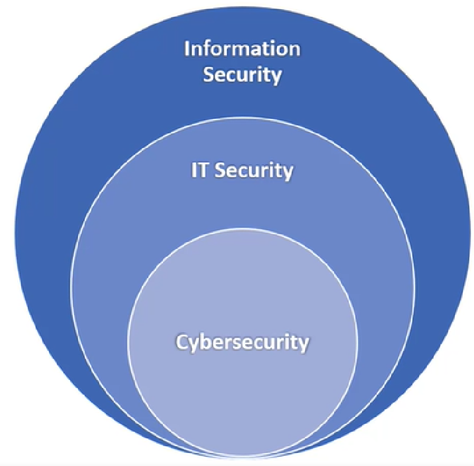
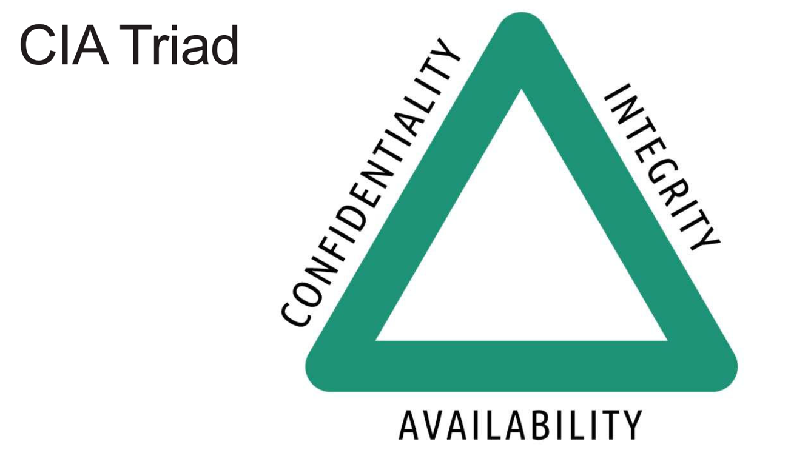
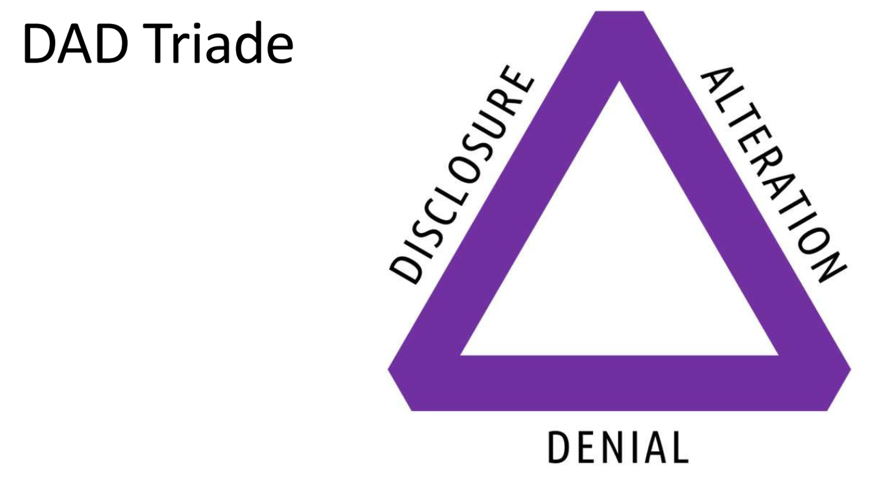
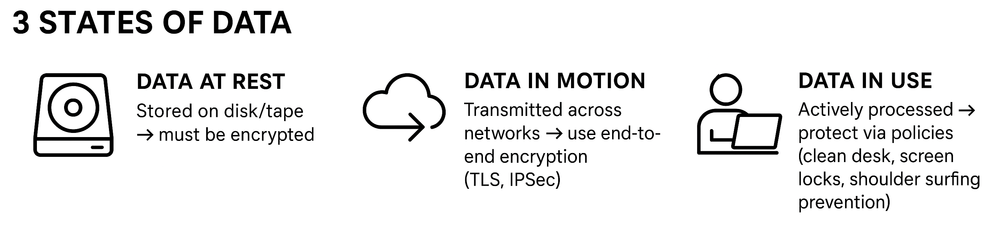

# IT Security Fundamentals

This section consolidates key concepts from **ISC2 CC Domain 1** and **CompTIA Security+**.  
It is designed as a **study guide for certification candidates** and a **teaching resource**.

---

## Purpose
- Provide clear, organized notes on core cybersecurity concepts.  
- Support students preparing for exams such as LSC2 CC and CompTIA Security+.  
- Showcase structured materials for academic reviewers and classroom use.  

---

## 1. Foundations of Security

### Information Security vs IT Security vs Cybersecurity

- **Information Security (InfoSec)**: Protects all forms of information e.g. paper, voice, digital, and human knowledge.
- **IT Security**: Focuses on hardware, software, networks, and data being processed, stored, or communicated.  
- **Cybersecurity**: Subset of IT Security, i.e. protecting systems and data accessible via the internet.

**Key takeaway**: Cybersecurity ⊂ IT Security ⊂ Information Security.

---

## 2. CIA Triad

The **CIA Triad** is the cornerstone of security:

- **Confidentiality**  
  - Ensures sensitive data is accessible only to authorized users.  
  - Techniques: Access controls, encryption (AES256, SSL/TLS), secure communication, policies, training.  
  - Example: Protecting customer payment data with TLS and multi-factor authentication.  

- **Integrity**  
  - Ensures data remains accurate, consistent, and trustworthy.  
  - Techniques: Hash functions (SHA‑256), checksums, digital signatures, access controls.  
  - Example: Detecting unauthorized changes in a file via hash mismatch.  
  - Case Study: *Stuxnet worm* altered centrifuge operations by subtly changing data integrity.  

- **Availability**  
  - Ensures authorized users can access data/systems when needed.  
  - Techniques: Redundancy (RAID, backup servers), fault tolerance, patch management, disaster recovery plans.  
  - Example: E-commerce site uptime (99.9% SLA) maintained via redundant servers.  

---

## 3. Opposite of CIA: DAD Triad

The **DAD Triad** represents threats that undermine CIA principles:

- **Disclosure** → Breach of confidentiality (unauthorized access).  
- **Alteration** → Loss of integrity (unauthorized changes).  
- **Destruction/Denial** → Attack on availability (data deletion, DDoS, hardware damage).  

---

## 4. Non-Repudiation
- Ensures a sender cannot deny sending a message or signing a document.  
- Implemented via **digital signatures** (cryptographic binding of identity to data).  

---

## 5. Three States of Data

Data exists in three states, each requiring protection:

- **Data at Rest**: Stored on disk/tape → must be encrypted.  
- **Data in Motion**: Transmitted across networks → use end-to-end encryption (TLS, IPSec).  
- **Data in Use**: Actively processed → protect via policies (clean desk, screen locks, shoulder surfing prevention).  

---

## 📊 Quiz
Challenge yourself: [IT Security Fundamentals Quiz](../quiz/quiz1.md)

---

## Author
Created and maintained by **Hesam Abdolhosseini**  