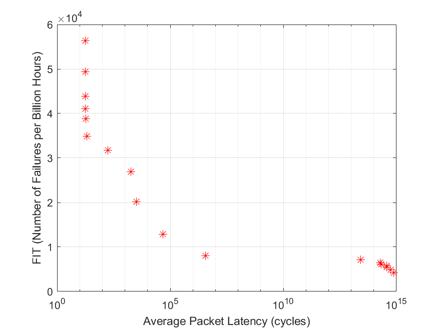

# Optimization Module

## Objective
Demonstrate multi-objective optimization for reliability and latency trade-offs in on-chip networks under buffer constraints.

## Method
- Implemented NSGA-II for exploring Pareto fronts.
- Evaluated trade-offs between latency and reliability metrics.
- Used synthetic workloads and buffer configurations for reproducibility.

## Results
- Pareto front curves showing latency vs reliability.
- Insights into how buffer sizing impacts resilience and throughput.
- The final Pareto front figure is saved automatically in optimization/docs/figures/pareto_front.png.



## Quickstart
```matlab
% Run the demo (this will automatically load helper functions)
run('optimization/scripts/run_noc_nsga.m')
